# 📊 Korean Investor Portfolio Optimizer

> AI-powered portfolio optimization system tailored for Korean retail investors —  
> with tax-aware backtesting, LLM-generated reports, and multi-strategy comparison.

**한국 개인 투자자를 위한 AI 기반 포트폴리오 최적화 시스템입니다.**  
세금 구조 반영 백테스팅, LLM 투자 리포트 자동 생성, 다전략 성과 비교를 포함합니다.

---

## 🗂️ Project Overview / 프로젝트 개요

This project implements a **semi-automated portfolio construction and evaluation pipeline** using U.S. equities and ETFs (2020–present). It compares four optimization strategies, incorporates the Korean tax structure (양도세, ISA account effects), and generates personalized investment reports via LLM.

미국 주식 및 ETF(2020년~현재)를 대상으로 포트폴리오 구성·평가 파이프라인을 구현했습니다.  
4가지 최적화 전략을 비교하고, 한국 세금 구조(양도세, ISA 절세)를 반영하며, LLM으로 개인화된 투자 리포트를 자동 생성합니다.

---

## 📈 Strategies & Results / 전략별 백테스팅 결과

> Backtesting period: 2020–2026 | Monthly investment: ₩300,000 | Universe: 7 U.S. stocks + 4 ETFs  
> 백테스팅 기간: 2020~2026 | 월 투자금: 30만원 | 유니버스: 미국 주식 7종 + ETF 4종

### Portfolio Strategy Comparison / 포트폴리오 전략 비교

| Strategy / 전략 | Return / 수익률 | Sharpe / 샤프 비율 | MDD |
|---|---|---|---|
| ETF 균형형 | **63.9%** | 1.85 | -6.54% |
| 블렌딩 (MV+RP) | **191.3%** | 1.86 | -20.72% |
| 모멘텀 | **155.8%** | 1.84 | -19.01% |
| 시가총액 | **266.4%** | 1.88 | -24.49% |

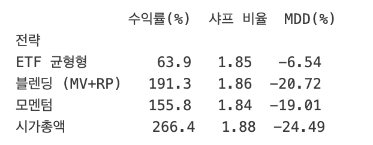

> 시가총액 전략이 가장 높은 수익률(266.4%)과 샤프 비율(1.88)을 기록했으나, MDD도 가장 컸음(-24.49%).  
> ETF 균형형은 수익률은 낮지만 MDD -6.54%로 가장 안정적인 하방 방어력을 보임.

### 4가지 전략 비교 차트

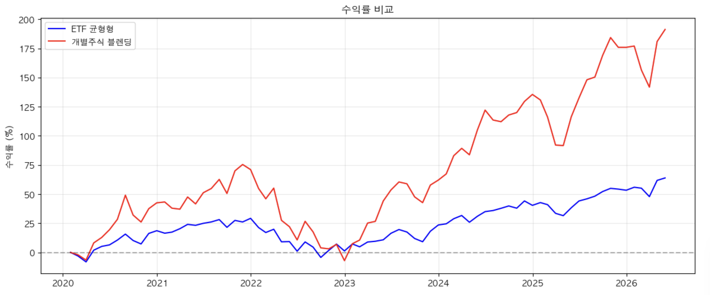

---

### ETF Universe Performance / ETF 개별 성과

| ETF | Ann. Return | Ann. Volatility |
|-----|-------------|-----------------|
| QQQ | 22.18% | 24.98% |
| SPY | 16.35% | 20.43% |
| SCHD | 13.06% | 19.03% |
| BND | 1.07% | 6.54% |

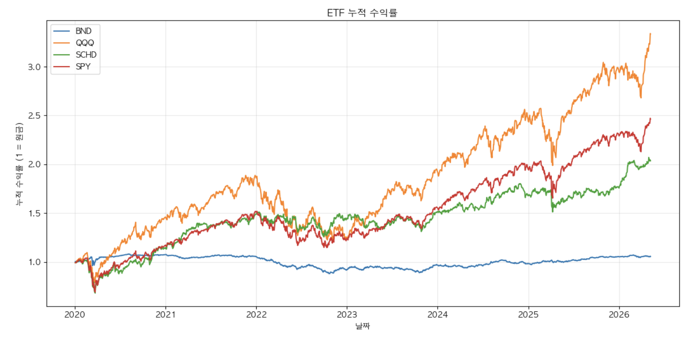

### ETF 균형형 백테스팅

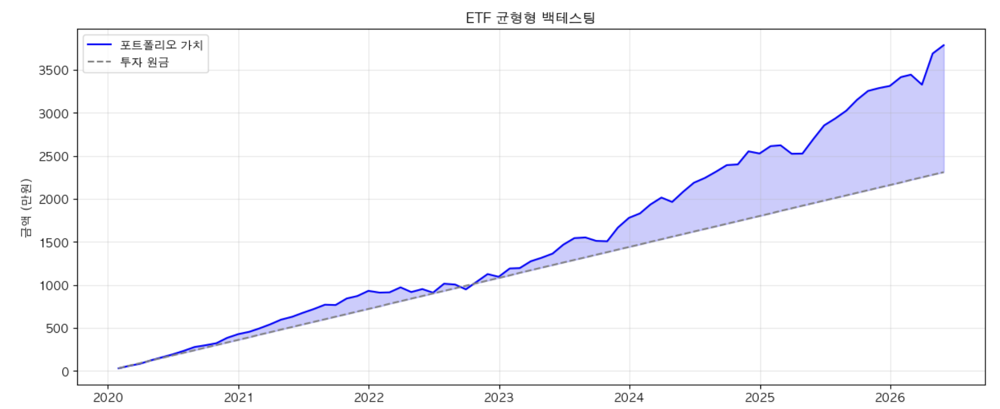

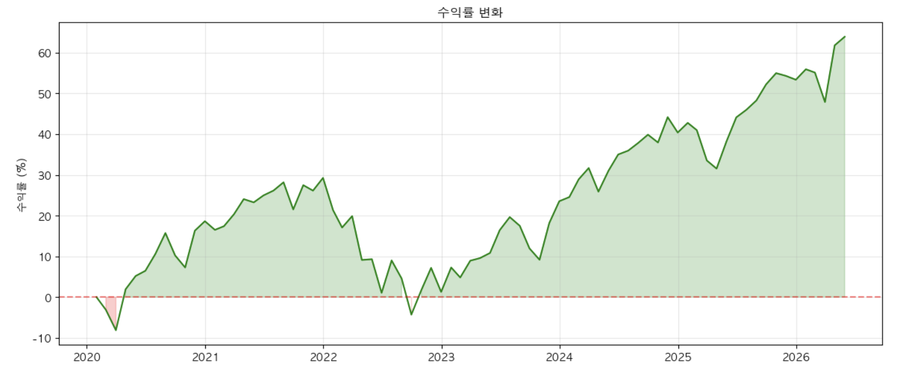

---

### 개별주식 블렌딩 백테스팅

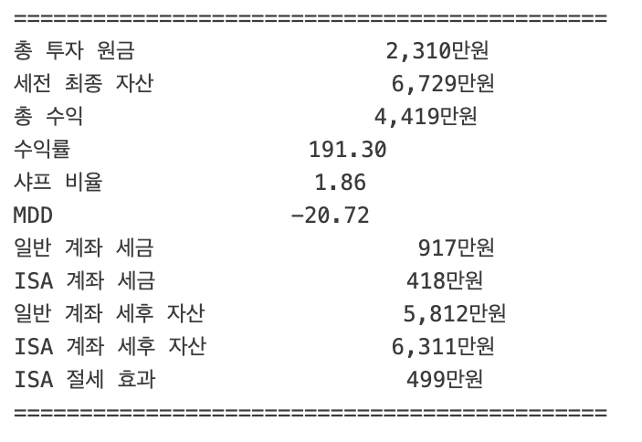

### ETF vs 개별주식 비교

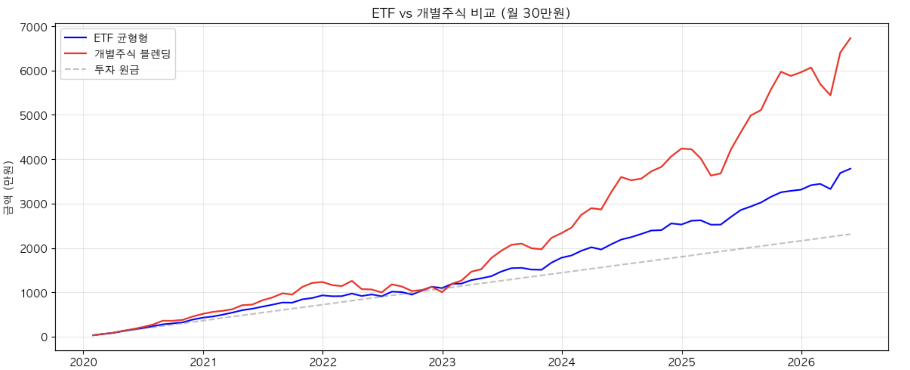

---

### DCA Comparison: NVO vs VOO / 적립식 투자 비교

> 총 투자 원금: 2,310만원 (2020~현재, 일 1,000원 or 월 20,000원 적립)

| Strategy / 전략 | Final Value / 최종 자산 |
|---|---|
| A: 매일 NVO | 147.6만원 |
| B: 매일 VOO | **276.6만원** |
| C: 매월 NVO | 142.7만원 |
| D: 매월 VOO | **264.8만원** |

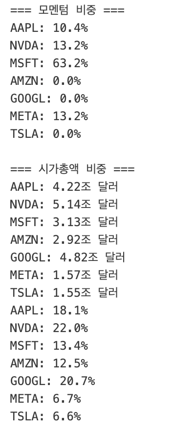

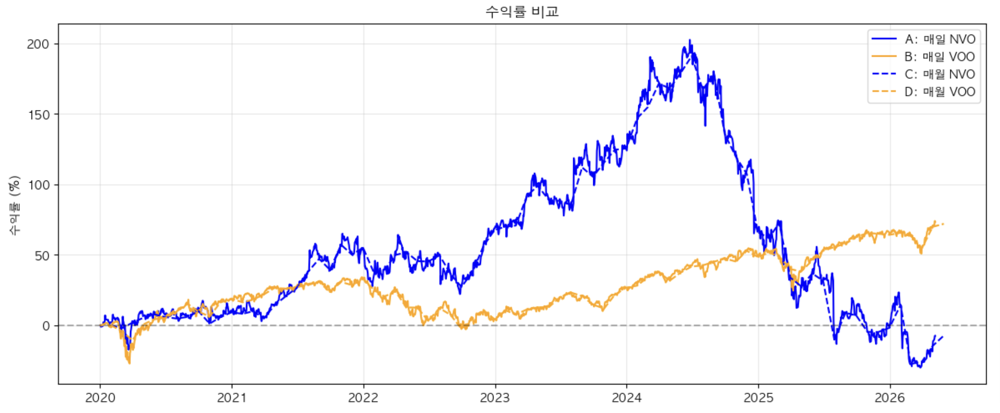

> VOO(S&P 500 ETF) 전략이 NVO 단일 종목 대비 일관되게 우수한 성과를 보였음.

---

### 월 투자금별 포트폴리오 가치

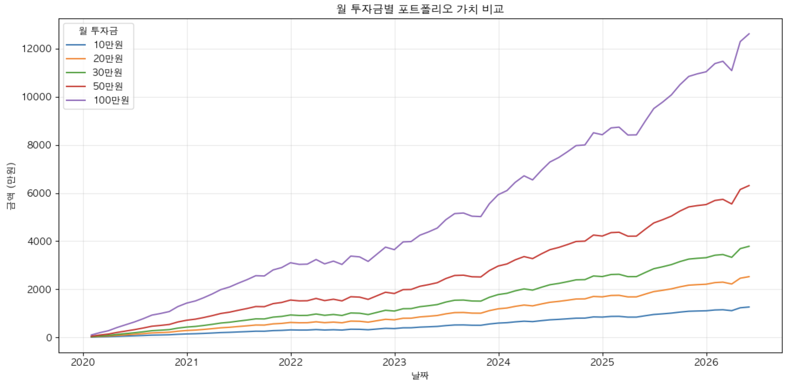

---

## 🇰🇷 Korean Tax Simulation / 한국 세금 시뮬레이션

한국 투자자 환경에 맞게 세금 구조를 직접 반영했습니다.

| 항목 | ETF 균형형 | 블렌딩 (MV+RP) |
|------|-----------|--------------|
| 총 투자 원금 | 2,310만원 | 2,310만원 |
| 세전 최종 자산 | 3,786만원 | 6,729만원 |
| 일반 계좌 세금 (양도세 22%) | 270만원 | 917만원 |
| ISA 계좌 세금 | 126만원 | 418만원 |
| **ISA 절세 효과** | **143만원** | **499만원** |

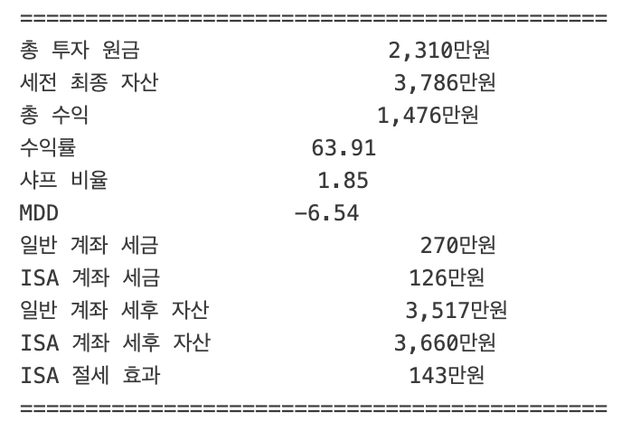

> ISA 계좌 활용 시 블렌딩 전략 기준 약 499만원의 세금 절감 효과가 있음.

---

## 📡 NVO Signal Analysis / NVO 투자 신호 분석

LLM 기반 뉴스 감성 분석 + 기술적 지표(RSI, 이동평균, 거래량)를 종합한 자동 매매 신호 시스템.

- RSI 73.8 → 과매수 구간 → 매도 신호
- MA20(41.3) > MA60(39.4) → 골든크로스 → 매수 신호
- 뉴스 감성 점수 -0.10 → 중립
- **종합 신호: 관망 (점수 +0.00)**


---

## 🏦 Universe / 투자 유니버스

### Individual Stocks (7 tickers) / 개별 주식

| Sector | Tickers |
|--------|---------|
| Technology | AAPL, MSFT, GOOGL, META, NVDA |
| Consumer | AMZN, TSLA |

**Blending Weights (MV + Risk Parity) / 블렌딩 비중:**

| Ticker | 최소분산 | 리스크패리티 | 블렌딩 |
|--------|---------|------------|------|
| AAPL | 25.2% | 17.2% | **21.2%** |
| GOOGL | 33.7% | 17.3% | **25.5%** |
| MSFT | 20.5% | 16.8% | **18.6%** |
| NVDA | 5.7% | 15.4% | **10.5%** |
| AMZN | 5.0% | 13.0% | **9.0%** |
| META | 5.0% | 10.4% | **7.7%** |
| TSLA | 5.0% | 9.9% | **7.5%** |

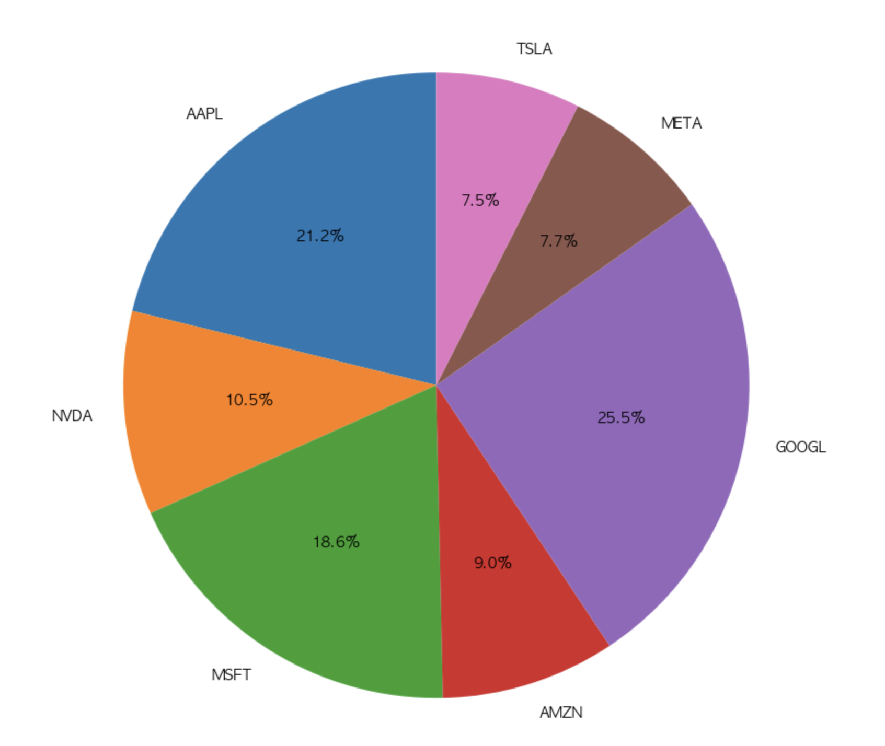

### ETF Portfolio / ETF 포트폴리오

| ETF | 설명 |
|-----|------|
| SPY | S&P 500 추종 |
| QQQ | 나스닥 100 추종 |
| SCHD | 배당 성장 ETF |
| BND | 미국 채권 ETF |

---

## 🔧 Pipeline / 파이프라인

```
데이터 수집 (yfinance, 2020~현재)
        ↓
ETF 누적 수익률 분석
        ↓
개별주식 최적 비중 산출 (최소분산 + 리스크패리티 → 블렌딩)
        ↓
4가지 전략 월별 백테스팅
    ├── ETF 균형형
    ├── 블렌딩 (MV+RP)
    ├── 모멘텀
    └── 시가총액
        ↓
한국 세금 계산 (양도세 22%, ISA 비과세 시뮬레이션)
        ↓
NVO 투자 신호 분석 (RSI + 이동평균 + 뉴스 감성)
        ↓
LLM 리포트 생성 (Groq API → 한국어 투자 요약)
```

---

## 🚀 Getting Started / 실행 방법

```bash
git clone https://github.com/sujin809/portfolio-optimizer.git
cd portfolio-optimizer
pip install -r requirements.txt
```

`config.py`에 Groq API 키를 입력한 후 `main.ipynb`를 실행하세요.

```python
# config.py
GROQ_API_KEY = "your_groq_api_key_here"
```

> ⚠️ `config.py`는 `.gitignore`에 포함되어 있습니다. API 키가 GitHub에 업로드되지 않도록 주의하세요.

---

## 🛠️ Tech Stack / 기술 스택

| Category | Libraries |
|----------|-----------|
| Data | `yfinance`, `pandas`, `numpy` |
| Optimization | `scipy`, `cvxpy` |
| Visualization | `matplotlib`, `seaborn` |
| LLM | `groq` (llama-3.3-70b-versatile) |

---

## 📁 File Structure / 파일 구조

```
portfolio-optimizer/
├── main.ipynb        # 메인 노트북 — 전체 파이프라인
├── portfolio.py      # 포트폴리오 최적화 모듈
├── backtest.py       # 백테스팅 함수
├── visualize.py      # 시각화 함수
├── tax.py            # 세금 계산 모듈
├── report.py         # LLM 리포트 생성
├── config.py         # API 키 설정 (미업로드)
├── images/           # 결과 이미지
└── README.md
```

---

## 👤 Author / 만든 사람

**정수진 (Sujin Jeong)**  
Industrial Engineering + Biomedical Engineering (Minor), UNIST  
Founder, FIC (Finance Investment Club — UNIST, KAIST, POSTECH, DGIST, GIST)  
GitHub: [@sujin809](https://github.com/sujin809)
