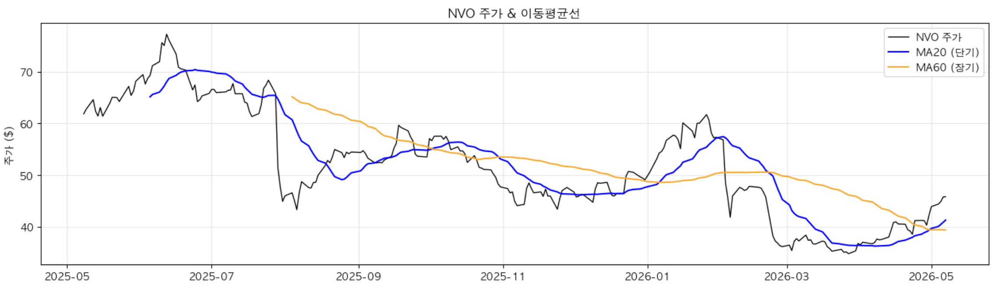
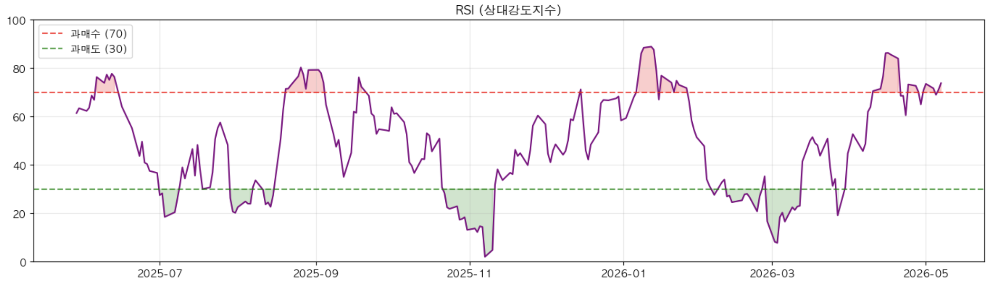
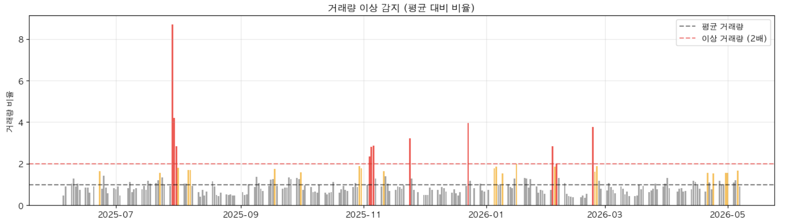
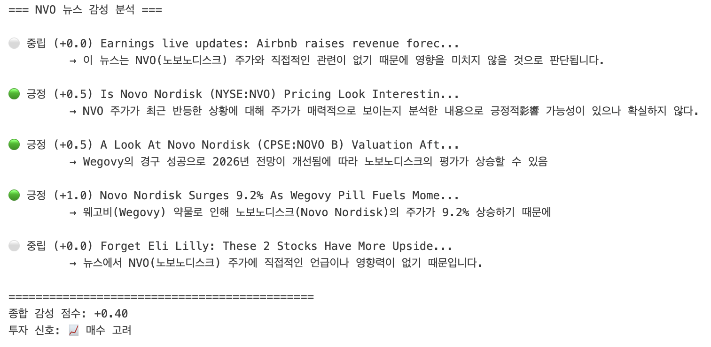
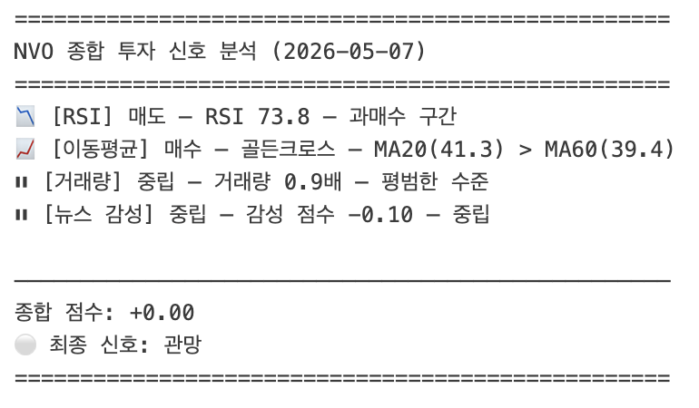

# NVO 투자 신호 분석

> LLM 기반 뉴스 감성 분석 + 기술적 지표(RSI, 이동평균, 거래량)를 종합한 자동 매매 신호 시스템.

---

## 신호 요약

| 지표 | 값 | 신호 |
|------|----|------|
| RSI | 73.8 | 과매수 → **매도** |
| MA20 vs MA60 | 41.3 vs 39.4 | 골든크로스 → **매수** |
| 뉴스 감성 점수 | -0.10 | 중립 |
| **종합 신호** | **+0.00** | **관망** |

---

## 기술적 지표 차트

---

## 뉴스 감성 분석

---

## 종합 투자 신호

---

## 해석

- RSI 73.8은 과매수 구간으로 단기 조정 가능성을 시사
- MA20 > MA60 골든크로스는 중장기 상승 추세를 나타냄
- 뉴스 감성이 중립(-0.10)으로 뚜렷한 방향성 없음
- 신호들이 상충되어 **현 시점 관망이 적절**한 판단
